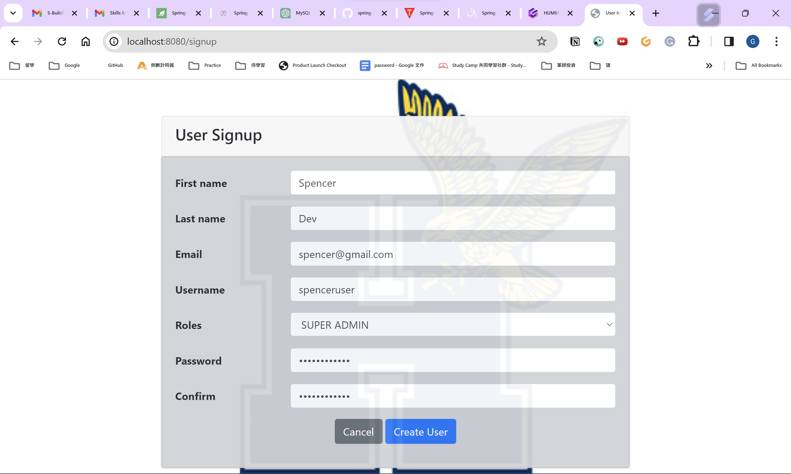
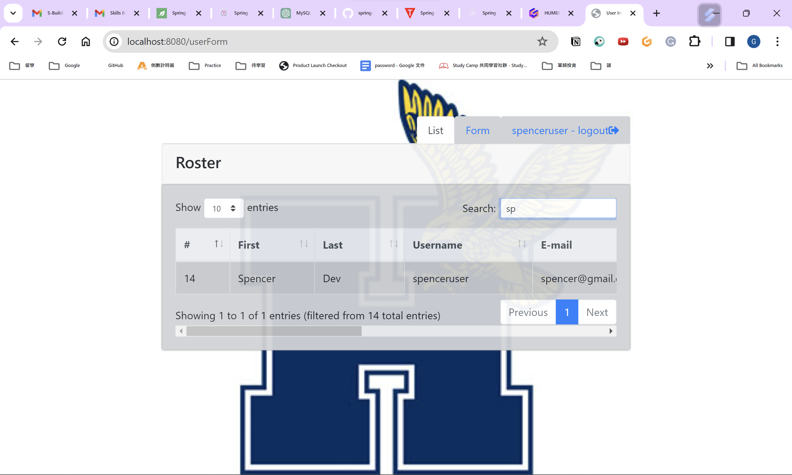

# user_management in HumberDevSquad

### Things todo list:

1. Clone this repository: `git clone ...`
2. Navigate to the folder: `cd user_management`
3. Run the application: `mvn clean spring-boot:run`
4. Open your favorite browser: http://localhost:8080

### Image Screen shots

Registration Page

List Users Page

### Image Screen shots
INSERT MYSQL  
Setting application.properties